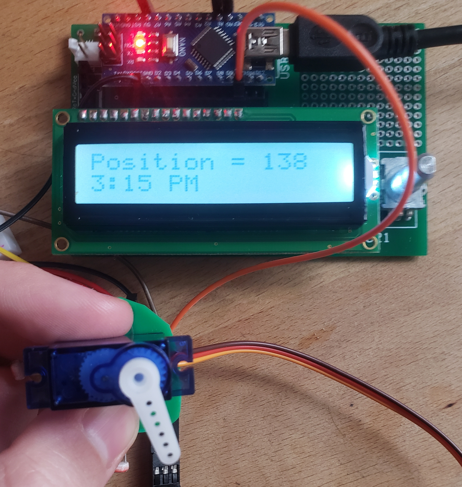

# Solar-Tracker
**Author:** Darius McAdam    
**Date:** May 2022  
**Purpose:** Final project for Intro to Computer Engineering (ECE 241)  
**Language:** C++  

## Description
The goal of the Solar-Tracker project was to replicate solar panels that track the sun thoughout the day. The project includes the following hardware.

- Arduino Nano
- Servo
- LCD
- Rotary encoder with push button
- Photoresistors

*Figure 1 - PCB with photoresistors and the servo*

*Figure 2 - PBC with the Arduino Nano, rotary encoder, and LCD*

If there is a bright enough light source on photoresistors, the servo will point towards the light. In the absence of bright light the servo position is based on the time of day. This represents the solar panels pointing to the position the sun would be on a cloudy day. After 6:00 PM the servo moves to zero degrees to anticipate the Sun rising at 6:00 AM. The mintues on the clock can be changed by rotating the encoder, and pressing the enocder will move the hours forward by one. 

*Figure 3 - Example of the project at noon*

*Figure 4 - Example of the project at 3:15PM*
